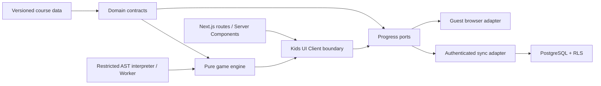

# ADR: інтеграція Kids Coding learning engine

- Статус: **прийнято для vertical slice**
- Дата: 2026-08-11
- Задача: T-501
- Наступна задача: T-502 — versioned data model

## Контекст

Systema вже є Next.js App Router порталом із TypeScript, Supabase Auth/PostgreSQL, RLS, каталогом курсів, enrollment, локальним і server progress та інтерактивними симуляторами. Kids Coding має додати інший тип навчання: короткі ігрові challenges у структурі `Course → World → Level → Challenge`, не порушуючи чинний High Load курс.

Перший vertical slice містить:

- `Robot Quest — Algorithms`, один world і п’ять levels;
- `Code Adventure — JavaScript`, один world і п’ять levels;
- visual World Map, Block Mode, Code Mode, hints, stars і persistent progress.

## Результат repository audit

### Routing і rendering

- `src/app` використовує Next.js App Router і Server Components за замовчуванням.
- `src/app/layout.tsx` надає спільні header, fonts, global styles і footer.
- Каталог і сторінка курсу читають version-controlled metadata із `src/content`.
- Server Components напряму читають Supabase; browser runtime використовує route handlers для sync.
- High Load full course тимчасово працює в `public/legacy`; preview уже використовує native `LessonShell`.

### UI system

- Глобальні tokens визначені CSS custom properties у `src/app/globals.css`.
- Manrope Variable використовується для UI, JetBrains Mono Variable — для коду й технічних labels.
- Базові правила вже включають text `>= 1rem`, WCAG AA corrections, `2.75rem` controls, responsive `rem/em/clamp()` і reduced motion.
- Kids Coding потребує власної game-like композиції, але не окремого design system.

### Authentication і data layer

- Supabase SSR працює через cookie-based session; Google, GitHub та email flows уже відокремлені від learning state.
- `courses`, `lessons`, `course_enrollments`, `lesson_progress`, `simulator_attempts` і `saved_architectures` захищені RLS.
- PostgreSQL catalog metadata є integrity/authorization allow-list; повний content залишається у коді.
- Персональні rows доступні лише їх власнику через `auth.uid()`.

### Progress і simulator boundaries

- `ProgressStore` уже відокремлює browser storage від Supabase persistence, але його lesson-oriented contract недостатній для worlds, stars, attempts і best solution.
- `createSimulatorEngine` правильно відділяє state, validation, rendering і persistence, але знаходиться у виключеному з TypeScript legacy runtime та має synchronous architecture-specific lifecycle.
- `FinalDesignState` демонструє потрібний pattern: parse untrusted state на server і повторно обчислити score замість довіри до client result.

## Рішення

### 1. Окрема feature vertical

Kids Coding розвивається нативно в `src/`, без додавання нової логіки у `public/legacy` і без передчасної переробки High Load курсу.

```text
src/
  app/
    kids/
      page.tsx
      [courseSlug]/
        page.tsx
        worlds/[worldSlug]/levels/[levelSlug]/page.tsx
  features/
    kids-coding/
      content/
      domain/
      engine/
      progress/
      ui/
      sandbox/
```

Назви папок можуть уточнюватися під час T-502, але dependency direction є обов’язковим:



Domain, engine і scoring не імпортують React, DOM, storage, Supabase або HTTP clients.

### 2. URL model

- `/kids` — Kids Coding dashboard;
- `/kids/[courseSlug]` — visual World Map;
- `/kids/[courseSlug]/worlds/[worldSlug]/levels/[levelSlug]` — shareable Level screen.

Stable IDs використовуються для persistence; slugs — лише для URL. Route перевіряє, що level належить world і course, та повертає `notFound()` для неузгодженої hierarchy.

`src/app/kids/layout.tsx` додає scoped Kids navigation/theme поверх чинного root layout. На першому етапі не створюємо другий root layout і не переносимо наявні routes.

### 3. Server/Client Component boundary

Server page:

- знаходить і runtime-validates course/world/level configuration;
- читає user/session і початковий progress напряму із Supabase;
- передає Client Component лише plain serializable data;
- не передає database clients, class instances або executable callbacks.

Client `LevelRuntime`:

- володіє поточним game state, command program і animation state;
- викликає pure engine та sandbox;
- рендерить immediate feedback і live announcements;
- зберігає guest progress через browser adapter або authenticated result через sync adapter.

Route handler виправданий для progress sync, тому що той самий client-side port має підтримувати guest/offline merge та authenticated API. Server-rendered reads залишаються прямими, без внутрішнього HTTP round trip.

### 4. Content source і data model

Для vertical slice source of truth — version-controlled TypeScript/JSON-compatible definitions. Це забезпечує code review, runtime validation, deterministic builds і простий rollback.

Обов’язкові сутності:

- `KidsCourseDefinition`;
- `WorldDefinition`;
- `LevelDefinition`;
- `ChallengeDefinition`;
- `CommandDefinition`;
- `ObjectiveDefinition`;
- `HintDefinition`;
- `RewardDefinition`.

Кожен persisted object має `schemaVersion`, stable ID і content version. Visible title ніколи не є identity.

PostgreSQL не зберігає повний executable course config на першому етапі. Окрема migration синхронізує лише published course/world/level metadata як allow-list для foreign keys і server validation.

### 5. Game engine

Engine є deterministic state machine:

```text
initial state + validated program
→ command steps
→ state transitions + visual events
→ objective evaluation
→ score / stars / friendly result
```

Engine повертає data events (`move`, `turn`, `collision`, `collect`, `complete`), а UI вирішує, як їх анімувати. Animation delay не є частиною domain state. Reset і cancellation не залишають background execution, що може змінити новий state.

Validation result розширює наявний pattern і залишається serializable:

```ts
type LevelResult = {
  valid: boolean;
  code: string;
  message: string;
  affectedIds: string[];
  stars: 0 | 1 | 2 | 3;
  metrics: { commandCount: number; usedConcepts: string[] };
};
```

Client score не є довіреним: authenticated save повторно parses program/state і обчислює result на server.

### 6. Block Mode і Code Mode

Обидва режими компілюються в один внутрішній `Program` AST. Engine не знає, чи program створено blocks або текстом.

- Block Mode генерує AST напряму та може показувати JavaScript equivalent.
- Code Mode parses дозволений JavaScript subset у той самий AST.
- Перемикання режиму можливе лише коли transformation не втрачає semantics; інакше UI пояснює обмеження.

Editor dependency не обираємо в T-501. У T-505 порівнюємо CodeMirror і Monaco за keyboard accessibility, tablet UX, bundle size та можливістю обмежити language features. Textarea з syntax assistance залишається допустимим lightweight fallback.

### 7. JavaScript sandbox

Не використовувати `eval`, `Function`, injected `<script>` або виконання user source у main application context.

Security boundary:

1. Bounded tokenizer/parser читає source без `eval`, `Function` або виконання user JavaScript.
2. Allow-list приймає лише підтримані declarations, integer literals, bounded loops, conditions, functions і виклики game API.
3. Compiler створює validated Program AST, який виконує deterministic game engine; user source ніколи не стає JavaScript функцією.
4. Ліміти: source size, tokens, nesting, parser steps, loop iterations, engine operations і wall-clock timeout.
5. AbortSignal, timeout, reset і navigation можуть скасувати compilation/execution без background mutation.
6. Server повторно parses і evaluates submitted best solution перед persistence.

Worker залишається optional performance adapter, якщо editor workloads зростуть. Він не потрібен як security boundary: bounded compiler не виконує arbitrary JavaScript і не надає learner source жодних host APIs.

### 8. Progress persistence

Створюється новий Kids progress port, а не розширюється lesson contract умовними полями:

```text
KidsProgressStore
  loadCourse(courseId)
  recordAttempt(attempt)
  completeLevel(result)
  claimReward(rewardId)
  merge(snapshot)
```

Рекомендовані нові таблиці:

- `course_worlds` — published world allow-list;
- `course_levels` — published level allow-list і content version;
- `level_progress` — completed, stars, best score/command count, attempts, updated time;
- `level_attempts` — idempotent attempt ID, schema/content version, bounded program snapshot і server result;
- `user_rewards` — unlocked cosmetics/achievements без monetization.

Усі user tables мають RLS за `auth.uid()`. Merge є monotonic: completion не скасовується, stars береться max, best metric покращується лише valid server-evaluated attempt, attempt IDs запобігають подвійному підрахунку.

Guest storage має окремий versioned key і не містить identity, auth state або authorization decisions. Після входу merge виконується через server validation.

### 9. Existing portal integration

- `courses` і `course_enrollments` повторно використовуються для двох Kids courses.
- Catalog summary contract з часом отримує discriminated `experience: "lesson" | "game"`; не додаємо `legacyPath`-умови для кожного нового типу курсу.
- `SiteHeader`, auth flows, profile і root tokens залишаються спільними.
- Kids visual tokens scoped під `.kids-shell`; глобальні tokens не змінюють High Load UI.
- Dashboard агрегує lesson progress і level progress через окремі read models, не маскує levels під lessons у UI.

### 10. Accessibility і child-oriented UX

- Drag-and-drop завжди має button/keyboard alternative: додати command, змінити порядок, видалити.
- Board має текстовий стан: position, direction, nearby obstacle, target і останню дію.
- Current, locked, completed і stars позначаються text/icon/semantics, не лише кольором.
- Execution result оголошується через live region без несподіваного перенесення focus.
- Reduced motion змінює animation на короткі state transitions, але не робить execution миттєвим або незрозумілим.
- Public feedback використовує friendly message; technical code доступний internal logging/tests.
- Мінімальний readable text залишається `1rem`, controls — не менше `2.75rem`.

### 11. Accounts і дитяча приватність

Recommended age є metadata курсу, а не полем профілю. Vertical slice не збирає дату народження, ім’я дитини, школу або інші нові child-specific personal data.

Guest mode залишається повноцінним локальним шляхом. Перед прямим запуском дитячої реєстрації потрібне окреме product/legal рішення щодо guardian-managed accounts, consent, retention, export/deletion і analytics. До цього моменту чинний auth не позиціонується як самостійний child account system.

## Відхилені варіанти

### Розширити `public/legacy`

Відхилено: runtime не типізований, виключений із TypeScript, має DOM-oriented rendering і збільшить migration debt.

### Представити worlds і levels як modules і lessons

Відхилено як основна domain model: це спростить першу migration, але швидко створить умовні поля для stars, attempts, locks, rewards і best solution. На рівні catalog/enrollment course можна повторно використати, а progress має бути окремим.

### Одразу зберігати весь content у PostgreSQL/CMS

Відхилено для vertical slice: ускладнює authoring, validation, versioning і rollback до стабілізації contracts. Database-ready serialization залишається вимогою T-502.

### Виконувати JavaScript у sandboxed iframe через `eval`

Відхилено: iframe зменшує blast radius, але не робить arbitrary execution достатньо контрольованим. Restricted AST interpreter дає явний language surface і deterministic operation budget.

## Наслідки й trade-offs

- З’являється друга progress model, але без забруднення lesson progress семантикою гри.
- Content metadata частково дублюється у code і PostgreSQL allow-list, як у чинного курсу; migration tooling має перевіряти parity.
- Restricted JavaScript subset не підтримуватиме всю мову, зате буде безпечним, навчальним і передбачуваним.
- Native feature збільшує React client bundle лише на Level route; dashboard і World Map мають залишатися переважно Server Components.
- Legacy engine не мігрує автоматично. Спільні pure validation ideas повторно використовуються через TypeScript contracts, а не прямий import із `public`.

## Implementation sequence

1. T-502: domain contracts, fixtures і runtime configuration validation.
2. T-503: pure deterministic engine та tests.
3. T-504: AST interpreter/Worker security spike та test corpus.
4. T-510: migration і progress ports.
5. T-505/T-506/T-507/T-511: UI vertical framework.
6. T-508/T-509: по п’ять playable levels.
7. T-512: complete accessibility, responsive, security і production verification.

## Decision gates before T-502 implementation

- IDs: `robot-quest-algorithms`, `code-adventure-javascript`; world/level IDs не залежать від title.
- Content source: TypeScript definitions із JSON-compatible values і runtime parser.
- Persistence: нові level-specific tables; existing enrollment і auth повторно використовуються.
- Execution: один internal AST для blocks/code; arbitrary JavaScript заборонено.
- UI: scoped Kids experience у native App Router routes; High Load legacy runtime не змінюється.
